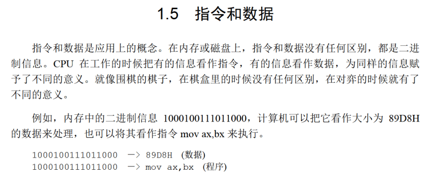
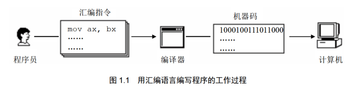

# 视频
## 从机器语言到汇编语言

机器语言，过于繁琐和难以编写。

## 汇编是什么？
实际上就是机器语言的助记符，给机器码起不同的有意义的名字

## 汇编语言的组成
1. 汇编指令（核心）：机器码的助记符，有对应的机器码
2. 伪指令：没有对应的机器码，计算机并不执行，由编译器执行
3. 其他符号，由编译器识别，没有对应的机器码

## CPU、寄存器与内存
CPU负责运算和指令执行

内存帮助CPU读取存储数据，CPU通过寻址来访问内存，进行数据读写

为了效率，寄存器充当暂存

## 内存之中存什么
指令和数据都有

## 存储单元
存储器被划分为若干个存储单元，每个存1Byte

## CPU对存储器的读写
存储单元被按顺序编号，编号就是地址

CPU要从内存中读取数据，就需要地址

因此需要三种信息：
- 地址信息
- 控制信息
- 数据信息

## 小结
汇编指令和机器指令一一对应，每一种CPU都有自己的汇编指令集

## 扩展知识
大部分为计组的内容。

# 书

## 总线
需要知道地址总线、数据总线、控制总线，其宽度对应的内容。

## 检测点1.1
1. $1KB=1024*8 bit=2^13 bit$, 宽度为13
2. 1024，0-1023
3. 8192，1024
4. $2^30,2^20,2^10$
5. 64,1,16,4
6. 1,1,2,4
7. 512,256
8. 二进制

## 其他
后面还有一些OS的知识，学过的应该不需要再看了

