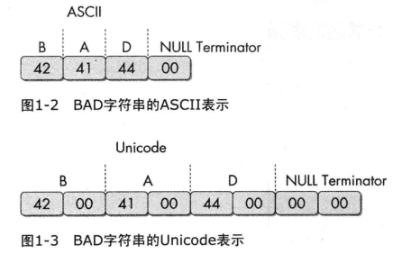
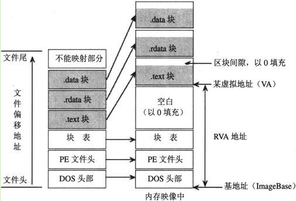
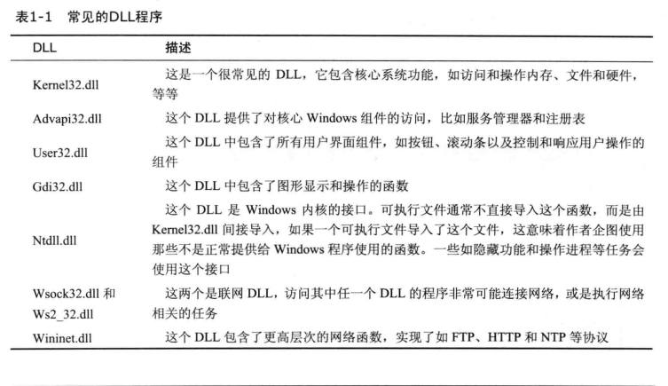

# 静态分析技术基础

## 反病毒引擎

可以用一些开源扫描引擎先扫一下病毒

## 哈希值

恶意代码的唯一标识。如果对hash不熟悉，这里需要一些密码学的知识。

工具：`md5deep`

## 查找字符串

工具：`strings`

strings会忽略上下文和格式，从整个文件中检测出可打印字符串。

### unicode编码

这里需要知道unicode和ascii的区别


## 加壳

加壳用来防止恶意代码被轻易分析出来。


**加壳和混淆代码通常包含 `LoadLibrary`和`GetProcAddress`函数，用来加载和使用其他函数功能**

### 检测

工具：`PEiD`

2011年停止支持，不知道有没有新的工具。

## PE文件格式

*本段内容由网络知识搜索而成，因为PE文件非常重要，书上这一点讲得太少！*

### 基本介绍

PE文件是Windows操作系统下使用的一种可执行文件，由COFF（UNIX平台下的通用对象文件格式）格式。

PE是“Portable Executable File Format”（可移植的执行体）的缩写。

PE文件是指 32 位可执行文件，也称为PE32。64位的可执行文件称为 PE+ 或 PE32+，是PE(PE32)的一种扩展形式（请注意不是PE64)，没有新的结构加入，只是简单地将以前32位字段扩展成64位。对于C++代码，Windows文件头的配置使其拥有不明显的区别。
事实上，一个文件是否是 PE 文件与其扩展名无关，EXE文件和DLL文件的区别完全是语义上的。它们使用完全相同的PE格式，唯一的区别就是用一个字段标识出这个文件是EXE还是DLL。

### 种类

|种类	|主扩展名|
|---|---|
|可执行系列	|EXE, SCR|
|库系列	|DLL, OCX, CPL, DRV|
|驱动程序系列	|SYS, VXD|
|对象文件系列	|OBJ|

### 基本形式

PE文件使用的是一个平面地址空间，所有代码和数据都被合并在一起，组成一个很大的结构。文件的内容被分割为不同的区块（Section，又称区段、节等），区块中包含代码或数据，各个区块按页边界来对齐，区块没有大小限制，是一个连续结构。每个块都有它自己在内存中的一套属性，比如：这个块是否包含代码、是否只读或可读/写等。

### 具体结构


1. DOS头 是用来兼容 MS-DOS 操作系统的，目的是当这个文件在 MS-DOS 上运行时提示一段文字，大部分情况下是：This program cannot be run in DOS mode. 还有一个目的，就是指明 NT 头在文件中的位置。
2. NT头 包含 windows PE 文件的主要信息，其中包括一个 'PE' 字样的签名，PE文件头（IMAGE_FILE_HEADER）和 PE可选头（IMAGE_OPTIONAL_HEADER32）。
3. 节表：是 PE 文件后续节的描述，windows 根据节表的描述加载每个节。
4. 节：每个节实际上是一个容器，可以包含 代码、数据 等等，每个节可以有独立的内存权限，比如代码节默认有读/执行权限，节的名字和数量可以自己定义，未必是上图中的三个。

### RVA VA

相对虚拟地址RVA与虚拟地址VA
>当一个 PE 文件被加载到内存中以后，我们称之为 " 映象 "（image），一般来说，PE文件在硬盘上和在内存里是不完全一样的，被加载到内存以后其占用的虚拟地址空间要比在硬盘上占用的空间大一些，这是因为各个节在硬盘上是连续的，而在内存中是按页对齐的，所以加载到内存以后节之间会出现一些 “空洞” 。

因为存在这种对齐，所以在 PE 结构内部，表示某个位置的地址采用了两种方式：

针对在硬盘上存储文件中的地址，称为 原始存储地址 或 物理地址，表示 距离文件头的偏移。
针对加载到内存以后映象中的地址，称为 相对虚拟地址（RVA），表示相对内存映象头的偏移。

**这里需要知道的是RVA=VA-ImageBase**

### 结构

#### DOS头

由MZ头和DOS存根组成


`MZ`头部是真正的DOS头部，由于其开始处的两个字节为“MZ”，因此DOS头也可以叫作MZ头。该部分用于程序在DOS系统下加载，它的结构被定义为IMAGE_DOS_HEADER。

其中，值得注意的是e_magic字段和e_lfanew字段
e_magic字段占两个字节，值为`0x5A4D`，对应ASCII码值为`'MZ'`，"MZ"其实是MS-DOS的创建者之一Mark Zbikowski名字的缩写。

e_lfanew字段占4个字节，位于从文件开始偏移`3Ch`字节处，用于指出NT头的偏移地址
```C
typedef struct _IMAGE_DOS_HEADER {
    WORD e_magic; //魔术数字
    WORD e_cblp;  //文件最后页的字节数
    WORD e_cp;    //文件页数
    WORD e_crlc;  //重定义元素个数
    WORD e_cparhdr;  //头部尺寸，以段落为单位
    WORD e_minalloc; //所需的最小附加段
    WORD e_maxalloc; //所需的最大附加段
    WORD e_ss;    //初始的SS值（相对偏移量）
    WORD e_sp;    //初始的SP值
    WORD e_csum;  //校验和
    WORD e_ip;    //初始的IP值
    WORD e_cs;    //初始的CS值（相对偏移量）
    WORD e_lfarlc; //重分配表文件地址
    WORD e_ovno;   //覆盖号
    WORD e_res[4]; //保留字
    WORD e_oemid;  //OEM标识符（相对e_oeminfo）
    WORD e_oeminfo;  //OEM信息
    WORD e_res2[10]; //保留字
    LONG e_lfanew;   //新exe头部的文件位置
} IMAGE_DOS_HEADER,*PIMAGE_DOS_HEADER;

```

#### NT头

PE最重要的头，由 DOS 头中的 e_lfanew 决定 ，表示 DOS头之后的 NT头相对文件起始地址的偏移

巨恶心的一大坨东西。

这一块儿最重要的是导入表、导出表、资源目录等。

*这里日后用到了再写，这一坨是真的恶心*

#### 节表

节表Section Table是一个结构数组，每个元素都是一个IMAGE_SECTION_HEADER结构，包含了对应节的属性、文件偏移量、虚拟偏移量等。
```C
typedef struct _IMAGE_SECTION_HEADER {
    +000h    BYTE Name[8]; //节名称，如".text"
    union {
        +008h    DWORD               PhysicalAddress;      // 物理地址
        +008h    DWORD               VirtualSize;          // 节长度
    } Misc;
    +00Ch    DWORD               VirtualAddress;       // RVA
    +010h    DWORD               SizeOfRawData;        // 对齐后的节尺寸
    +014h    DWORD               PointerToRawData;     // 基于文件的偏移
    +018h    DWORD               PointerToRelocations; // 重定位的偏移
    +01Ch    DWORD               PointerToLinenumbers; // 行号表的偏移
    +020h    WORD                NumberOfRelocations;  // 重定位项数目
    +022h    WORD                NumberOfLinenumbers;  // 行号表中行号数目
    +024h    DWORD               Characteristics;      // 节属性
} IMAGE_SECTION_HEADER, *PIMAGE_SECTION_HEADER;
```

### PE 文件的执行顺序

1. 当一个 PE 文件 被执行时，PE 装载器 首先检查 DOS header 里的 PE header 的偏移量。如果找到，则直接跳转到 PE header 的位置。
当 PE装载器 跳转到 PE header 后，第二步要做的就是2. 检查 PE header 是否有效。如果该 PE header 有效，就跳转到 PE header 的尾部。
3. 紧跟 PE header 尾部的是节表。PE装载器执行完第二步后开始读取节表中的节段信息，并采用文件映射（ 在执行一个PE文件的时候，Windows并不在一开始就将整个文件读入内存，而是采用与内存映射的机制，也就是说，Windows装载器在装载的时候仅仅建立好虚拟地址和PE文件之间的映射关系，只有真正执行到某个内存页中的指令或者访问某一页中的数据时，这个页面才会被从磁盘提交到物理内存，这种机制使文件装入的速度和文件大小没有太大的关系 ）的方法将这些节段映射到内存，同时附上节表里指定节段的读写属性。
4. PE文件映射入内存后，PE装载器将继续处理PE文件中类似 import table （输入表）的逻辑部分。

### ref

- [博客](https://www.cnblogs.com/cyx-b/p/13485664.html)
- [这个很细，建议和上面那个结合看](https://blog.csdn.net/freeking101/article/details/102752048)
- [这个很清楚，有简要的要点](https://liwz11.com/blog/archives/404.html)

## Dependency Walker

是个工具，探索动态链接函数的。

### 常见的DLL



### 函数命名约定

Ex,是微软在更新新函数和旧函数不兼容时加入的东西。

而A和W结尾是指接受参数分别是ascii和unicode

### 导入导出

需要自己熟悉一些windows函数

### PEview

工具，查看PE文件格式的

### Resource Hacker

工具，查看资源节

### 其他工具

PEBrowse Professional

PE Explorer
